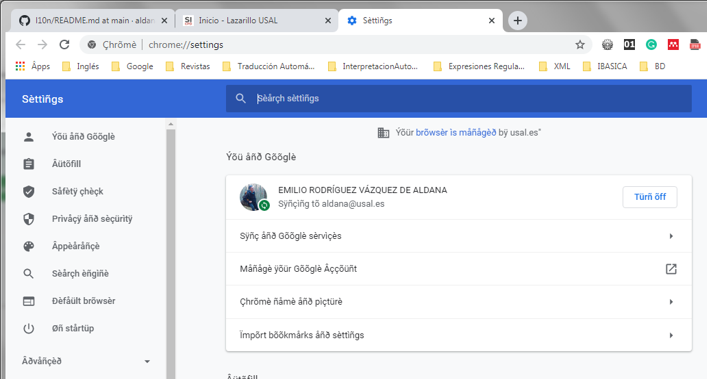

# Localización de archivos PAK ".pak" 

## Práctica de Localización en el Grado de Traducción e Interpretación de la USAL

El formato PAK (".pak") es utilizado, por algunas aplicaciones, para contener el texto de la interfaz de usuario de las diferentes lenguas a las que se encuentra localizado. Por tanto, es otro formato usado como arquitectura de internacionalización. Por ejemplo, es el caso, en la actualidad, del navegador Chrome.

En GitHub el proyecto [chrome-pak-customizer](https://github.com/myfreeer/chrome-pak-customizer/releases) ofrece el programa pak_mingw64.exe (o pak_ming32.exe) que permite el desempaquetado y empaquetado de los archivos ".pak".

El resultado del desempaquetado de un fichero PAK es un conjunto considerable de ficheros. En realidad, tantos como mensajes de texto contenga la aplicación. Por ejemplo, en la versión que tengo actualmente instalada de Chrome (2/12/2020), el desempaquetado de la versión inglesa de EE.UU. ("en-US.pak"), genera 4946 ficheros que, como hemos indicado, cada uno contiene un mensaje concreto de la interfaz de usuario de Chrome.

Valiéndonos de este programa de empaquetado/desempaquetado de ficheros PAK (pak_mingw64.exe) hemos creado dos pequeños scripts, con fines únicamente docentes, con el objetivo de aumentar el abanico de prácticas a realizar con nuestros ***estudiantes del Grado de Traducción e Interpretación de la USAL***:
1. ***pak2csv.py*** (que también ofrecemos en versión ejecutable de 64 bits para Windows, ***pak2csv.exe***) que reúne todos los archivos desempaquetados por pak_mingw64.exe en un solo fichero CSV (".csv") y que, por tanto, contendrá todos los mensajes de la aplicación.

2. ***csv2pak.py*** (y la versión ejecutable para Windows de 64 bits ***csv2pak.exe***) que recoje el fichero CSV  y genera el fichero PAK. 

En el proceso de *Localización* de una aplicación cuyos mensajes se distribuyan en formato PAK, se tratará, lógicamente, de enviar el CSV generado con **pak2csv.exe** a una herramienta de TAO para, tras la traducción a una nueva lengua, convertir el nuevo CSV en un nuevo fichero PAK, con la versión en destino usando, esta vez, **csv2pak.exe**

Se distribuye en este proyecto también el archivo **okf_table@csv2pak.fprm**, un filtro CSV para [Rainbow -Okapi Applications-](https://bintray.com/okapi/Distribution) adaptado para el CSV generado con nuestro script. Este filtro captura como etiquetas internas las diferentes partes del texto que no debe de traducirse de los diferentes mensajes de la aplicación.

## Uso de pack2csv.exe

```
pak2csv -i <file.pak> [-e <carpeta de pak_ming64.exe]
```
Si -e no está presente, se asume que en el directorio de trabajo se encuentra **pak_ming64.exe**.
El script crea, al finalizar, un archivo ".ini" con nombre <file.pak>, sin extensión, al que se añade la cadena "@csv2pak.ini". Este archivo es necesario para el proceso inverso (csv2pak.exe) 

## Uso de csv2pak.exe

```
csv2pak -i <file.csv>  -c <file.ini> [-e <carpeta de pak_ming64.exe]
```
Si -e no está presente, se asume que en el directorio de trabajo se encuentra **pak_ming64.exe**.


## Ejemplo de uso:

Supongamos que tenemos en el directorio de trabajo se encuentran los archivos [pak_mingw64.exe]  (https://github.com/myfreeer/chrome-pak-customizer/releases) y ***pak2csv.exe*** y ***csv2pak.exe***

```
pak2csv -i en-US.pak
```

El archivo en-US.pak.csv (columna 1: identificador, columna 2: texto en lengua origen) será transformado en una TAO a lengua destino (columna 1: identificador, columna 2: texto en destino)

```
csv2pak -i en-US.pak.csv -c en-US@csv2pak.ini 
```

La ejecución de este script devolverá el fichero en formato PAK en-US.pak.csv.pak.

Mostramos en estas dos imágenes del resultado de la conversión a CSV del fichero en-US.pak con ***pack2csv.exe***, la pseudo-traducción con ***Rainbow***  (*Utilities >> Text Rewriting* y en *Text Modification* eligiendo la opción *Replace selected ASCII charaters with Extended Latin Characters*) usando el filtro **okf_table@csv2pak.fprm** que facilitamos y, por último de la vuelta a generar el nuevo PAK pseudo-traducido con ***csv2pak.exe***.



